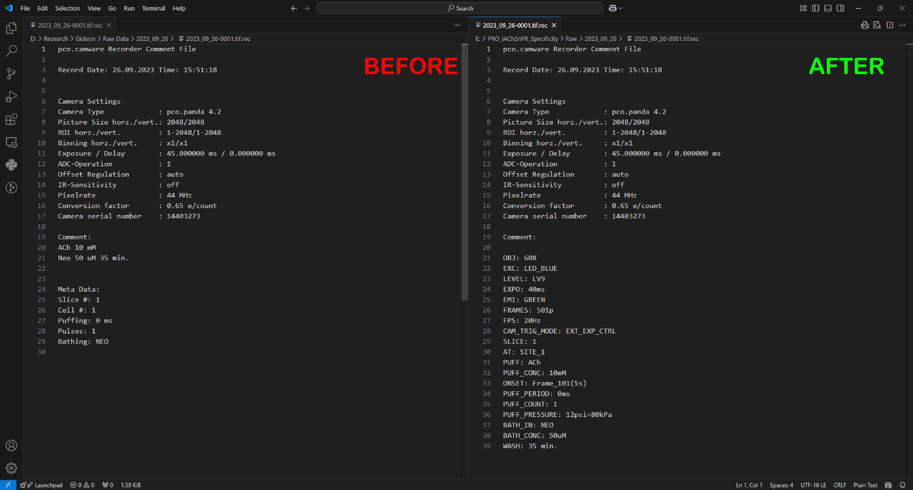
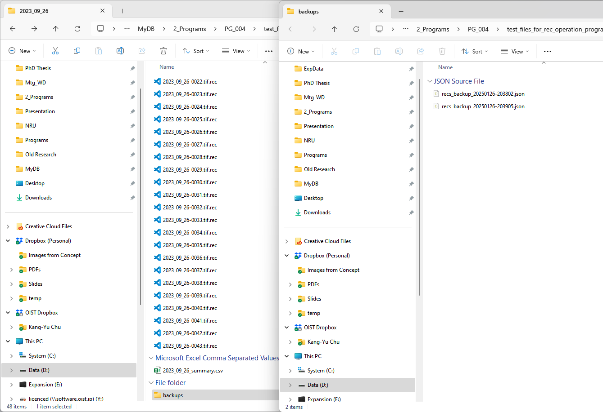

# OUTPUT

The program also generate a summary csv file and a "backups" folder for recovery

# MEMO
- A class of file dialog (dialog_getPath.py) is made to quickly generate a dialog for getting path of recording files or other types (xls, csv, json, text, ) of files.
- The xlsx_to_json.py is used for extracting values from an old template of expInfo and recs. I just keep it in case of future excel file applications.

