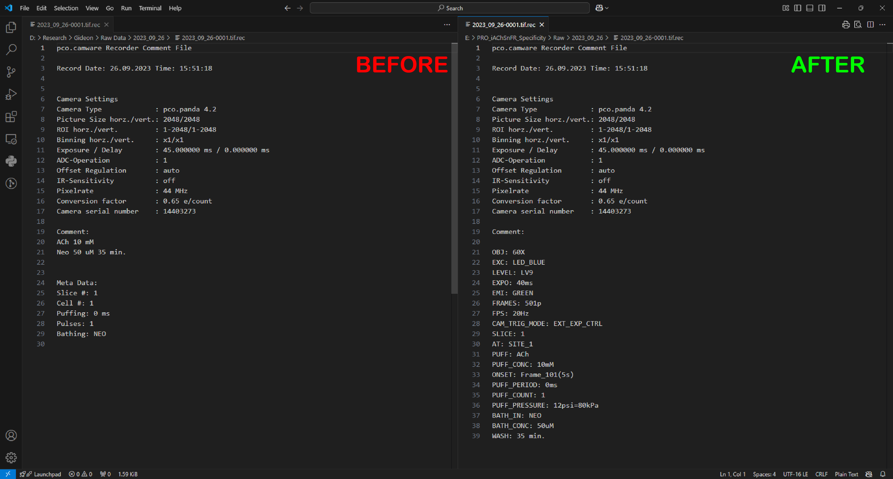
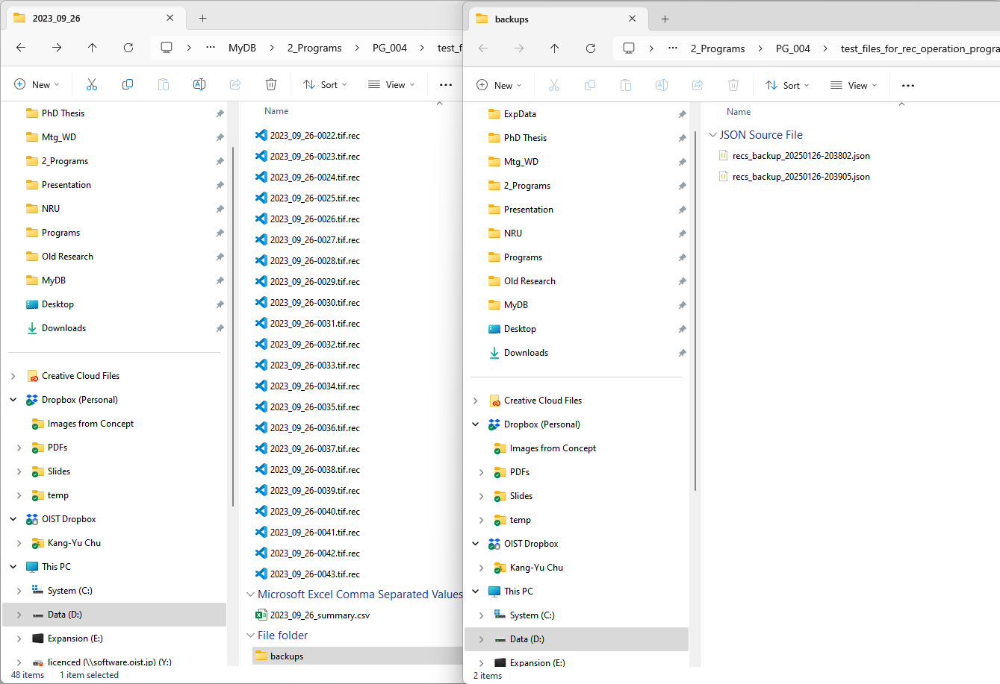
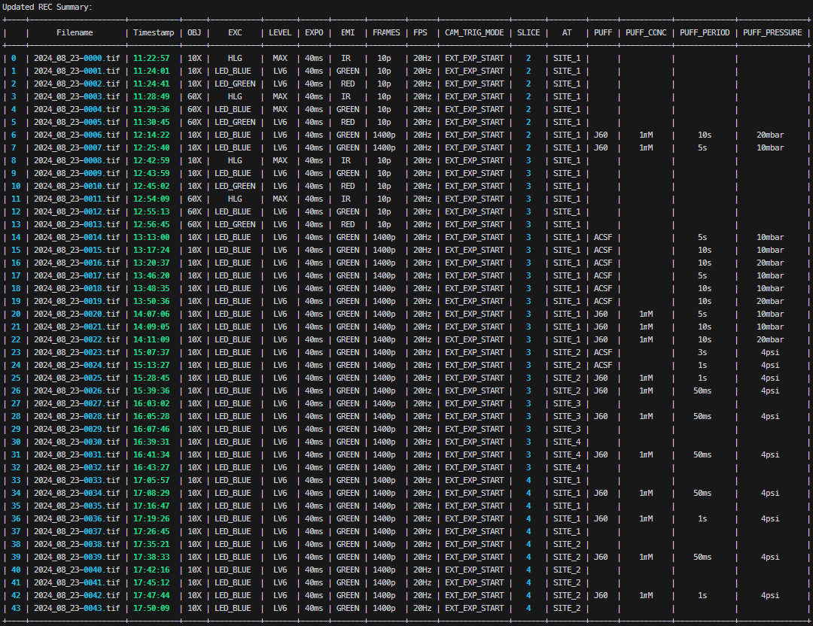
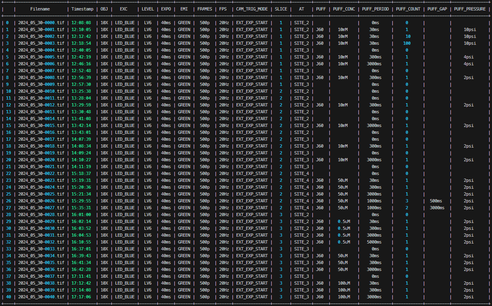

# OUTPUT

The program also generate a summary csv file and a "backups" folder for recovery

## Preview the output in terminal windows
#### JSON version
Preview the new summary of recording files modified from read old REC summary_updated.json:

Preview the metadata (only show last one) that is going to be written to corresponding .tif.rec file

#### REC version
Preview the summary of scanning results of all recording files

Preview the new summary of recording files modified from old summary of scanning results

Preview the metadata (only show last one) which is going to be written in corresponding .tif.rec file

#### XLSX version
Preview the expInfo read from the sheet 1 (dataLog) of ImgRecord.xlsx

Preview the old summary of recording files from the sheet 2 (RECs) of ImgRecord.xlsx

Preview the  expInfo which will be exported as markdown format

Preview the new summary of recording files modified from the old summary of recording files generated based on sheet 2

Preview the metadata which is going to be written to corresponding .tif.rec file

# MEMO
- classes and functions were created to be commonly applied to the 4 python programs
	- rec_comment_updater_ver_JSON.py
	- rec_comment_updater_ver_REC.py
	- rec_comment_updater_ver_XLSX.py
	- rec_rename_files.py
- Three scripts support three different types of old formats (\*\_REC summary_updated.json, 20xx_xx_xx-xxxx.tif.rec,\*\_ImgRecord.xlsx)
	- rec_comment_updater_ver_JSON.py
	- rec_comment_updater_ver_REC.py
	- rec_comment_updater_ver_XLSX.py
- use rec_rename_files.py to rename the \*.tif.rec and \*.tif to have date_serial format in (20xx_xx_xx-xxxx)
- Workflow
	- step_01: read old summary of recording files
	- **manually** modified the old one into new summary of recording files
	- save backups
	- write to each .rec files
> [!info]
> The XLSX version is the only one which can also export expInfo as markdown file
> The expInfo markdown files of the other types were created using Metadata Generator (PG_003)

> [!caution] Folders of applied version
> - ver_JSON
> 	- PRO_iAChSnFR_Specificity/Raw
> 		- 2024_09_26
> 		- 2024_10_05
> 		- 2024_10_12
> 		- 2024_03_07
> 		- 2024_03_22
> 	- PRO_Neurochemical_Signaling_Temporal_Spatial_Dimensions/Raw
> 		- 2024_07_11
> 		- 2024_07_12
> 		- 2024_08_15
> 		- 2024_08_23
> 		- 2024_10_03
> 		- 2024_10_11
> 		- 2024_12_19
> 		- 2025_01_01
> - ver_REC
> 	- PRO_Neurochemical_Signaling_Temporal_Spatial_Dimensions/Raw
> 		- 2024_02_15
> 		- 2024_02_23
> - ver_XLSX
> 	- PRO_Neurochemical_Signaling_Temporal_Spatial_Dimensions/Raw
> 		- 2024_05_11
> 		- 2024_05_27
> 		- 2024_05_30

# Log
## 2025-Jun-27
Remove the duplicated markdown file (keep only README.md)